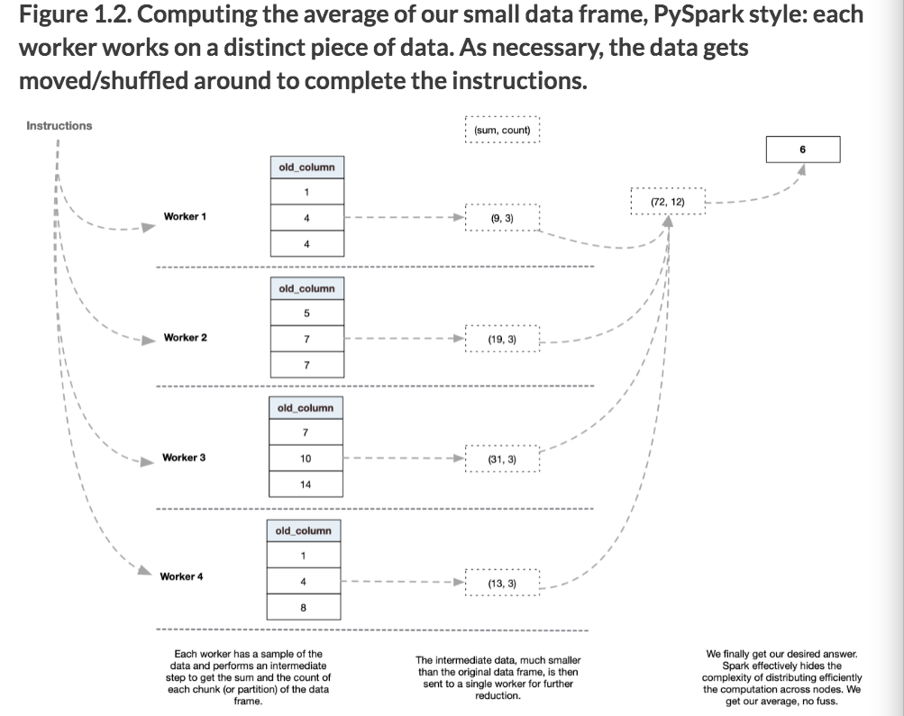

# Data Analysis with Python and PySpark

## Environment setup

1. Install homebrew
2. Install Java and Spark via  `brew install apache-spark`
    - Save yourself a headache by running `sudo ln -sfn $(brew --prefix)/opt/openjdk@11/libexec/openjdk.jdk /Library/Java/JavaVirtualMachines/openjdk-11.jdk` after installation.  This makes sure system Java wrappers find the Java development kit (JDK) associated with this package.
3. Create conda environment via `conda create -n pyspark python=3.8 pandas pyspark=3.0.0`
4. Activate conda environment by `conda activate spark`
5. Install jupyter notebook to your environment via `conda install -c conda-forge notebook`
    - Add the environment to your notebook:
    ```
    conda install -c anaconda ipykernel
    python -m ipykernel install --user --name=pyspark
    ```

## Chapter 1: Basics

### Structure

- Pypark is slower than native Scala code.  At its core, Pyspark code needs to be translated to Scala via JVM (Java Virtual Machine).  This causes a speed bottleneck. 

### Terminology

- "Workers" are called _executors_ in Spark lingo.  They perform the actual work on the machines.  They perform the actual work on the machines.
- The _master_ node manages these workers.
- The _driver program_ is the task that the workers are going to run.
- _Cluster managers_ is a program that plans the capacity it will allocate to the driver program.  Spark provides its own manager, but can use others like YARN, Mesos, Kubernetes, etc.
- Any directions about capacity (machines and executors) are encoded in a _SparkContext_ object which represents the connection to our Spark cluster.
- Master allocates data to _executors_, which are the processes that run computations and store data for the application.
- Executors sit on _worker nodes_ which is the actual computer.
- Executor = actual worker, worker node = workbench that the executor performs work on.

Example of 4 workers working together to calculate and average of one column:



#### Lazy vs Eager Evaluation

Python R Java are eagerly evaluated.  Spark is lazily evaluated.

Spark distinguishes between __transformations__ and __actions__.

Transformations are:
- Adding a column to a table
- Performing aggregations
- Computing stats
- Training a ML model on data
- Reading data

Actions are:
- Printing information to the screen (i.e. `show`)
- Writing data to a hard drive or a cloud bucket (i.e. `write`).

A Spark program will avoid performing any data work an action triggers the computation chain.  Before that the master will _cache_ your instructions.  Benefits are:
1. Storing instructions in memory takes less space than storing intermediate data frames.
2. Caching the tasks allow the master to optimize the work between the executors more efficiently.
3. If one node fails during processing, Spark can recreate missing chunks of the data by referring to the cached instructions.  Simply put, it handles the data recovery part.

### Pyspark program in a nutshell

1. We first encode our instructions in Python code, forming a driver program.
2. When submitting our program (or launching a PySpark shell), the cluster manager allocates resources for us to use. Those will stay constant for the duration of the program.
3. The master ingests your code and translate it into Spark instructions. Those instructions are either transformations or actions.
4. Once the master reaches an action, it optimizes the whole computation chain and splits the work between executors. Executors are processes performing the actual data work and they reside on machines labeled worked nodes.


## Chapter 2: First Data Program in Pyspark

Most data-driven application functions in the Extract-Transform-Load (ETL) pipeline:

1. Ingest or read the data we wish to work with.
2. Transform the data via a few simple instructions or a very complex machine learning model
3. Export the resulting data, either into a file to be fed into an app or by summarizing our findings into a visualization.

### `SparkSession` entry point

- `SparkSession` provides an entry point to Spark.
  - Wraps `SparkContext` and provides functionality for interacting with the data.
- Can be used as a normal object imported from a library in Python.
- `SparkSession` builder: builder pattern with set of methods to create a configurable object.

Creating a `SparkSession` entry point from scratch
```py
from pyspark.sql import SparkSession

spark = (SparkSession
         .builder
         .appName("Analyzing the vocabulary of Pride and Prejudice.")
         .getOrCreate())
```
